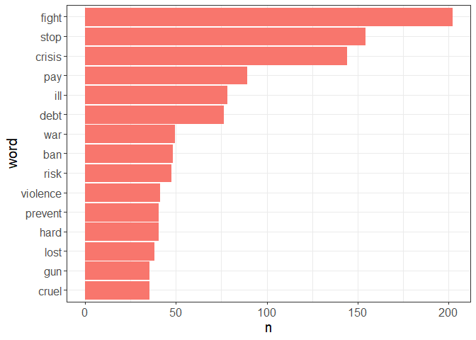
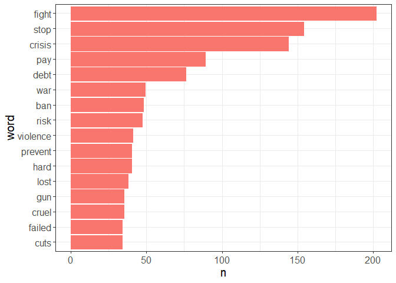
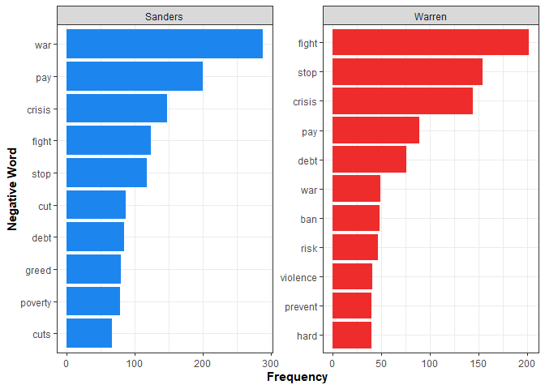
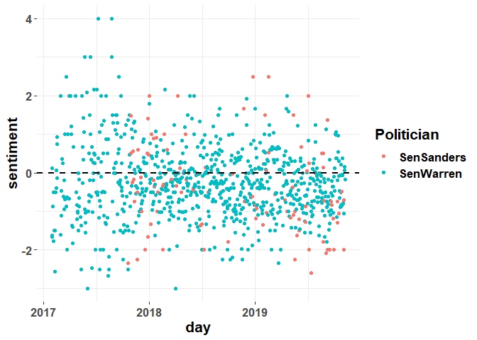

Analyze sentiment of politicians’ tweets using lexicon methods
================

Use the ‘tidytext’ package to analyze the mean sentiment (based on the
AFINN lexicon) in Warren and Sanders recent tweets. If you have not set
up creditials to connect to Twitter’s API, view this
[tutorial](https://rtweet.info/articles/auth.html). If you want to
follow along without actually connecting to Twitter’s API you can
download
[“warren\_timeline\_11.7.19”](https://drive.google.com/file/d/186fMQYZE2YUAkNVkTM6YWmpZOWJP5zNJ/view?usp=sharing)
and
[“bernie\_timeline\_11.7.19”](https://drive.google.com/file/d/18IOQ_0tcwj9UQi1XYgNfN5aqM0r9rzwQ/view?usp=sharing).

## Setup

``` r
# load libraries ----
library(rtweet)
library(tidyverse)
library(maps)
library(tidytext)
library(lubridate)


# authenticate for Twitter API access ---- 
# first establish authentication. Replace the dummy values below with your own
create_token(
  app = "my_twitter_research_app",
  consumer_key = "XYznzPFOFZR2a39FwWKN1Jp41",
  consumer_secret = "CtkGEWmSevZqJuKl6HHrBxbCybxI1xGLqrD5ynPd9jG0SoHZbD",
  access_token = "9551451262-wK2EmA942kxZYIwa5LMKZoQA4Xc2uyIiEwu2YXL",
  access_secret = "9vpiSGKg1fIPQtxc5d5ESiFlZQpfbknEN1f1m2xe5byw7")
```

## 1 - Collect Elizabeth Warren’s most recent \~3200 tweets (limit of Twitter’s standard API)

#### (Or jump to step 2 if you’ve downloaded the [“warren\_timeline\_11.7.19”](https://drive.google.com/file/d/186fMQYZE2YUAkNVkTM6YWmpZOWJP5zNJ/view?usp=sharing) data directly)

``` r
# get Elizabeth Warren's most recent ~3200 tweets (API limit)
warren <- get_timelines("SenWarren", n = 5000)

# clean dataframe
warren_clean <- warren %>% select(screen_name, text, created_at)
```

## 2 - Preprocessing Warren Tweets

``` r
# load in data if you didn't collect your own tweets
warren_clean <- read_csv("warren_timeline11.7.19.csv")

# remove URLs
warren_clean$text <- gsub("https\\S*","", warren_clean$text)
# remove "@username" tags
warren_clean$text <- gsub("@\\w+", "", warren_clean$text) 

# put data into tidy text format - note we use 'token = 'tweets'' for twitter-specific text preprocessing
warren_tidy <- warren_clean %>% 
  unnest_tokens(word, text, token = "tweets") %>% 
  # remove numbers
  filter(!str_detect(word, "^[0-9]*$")) %>%
  # remove stop words
  anti_join(stop_words)
```

## 3 - Perform sentiment analysis with AFINN lexicon

The [AFINN
lexicon]((http://corpustext.com/reference/sentiment_afinn.html))
measures negative / positive valence on a -5 to +5 scale

``` r
# note there are other lexicons you can call see ?get_sentiments for details
w_sent <- warren_tidy %>% left_join(get_sentiments('afinn')) 

# plot most frequent negative or positive words
<<<<<<< HEAD
# value < 0 = negative sentiment, value > 0 = positive sentiment
w_sent %>% filter(value < 0) %>% count(word) %>% 
=======
# score < 1 = negative sentiment, score > 1 = positive sentiment
w_sent %>% filter(score < 1) %>% count(word) %>% 
>>>>>>> d32484bf3abec9224bf8d90e4c895d7f314a2fd6
  top_n(15) %>% mutate(word = reorder(word, n)) %>% 
  ggplot(aes(word, n, color = "red", fill = "red")) +
  geom_col(show.legend = FALSE) +
  coord_flip() +
  theme_bw() +
  theme(text = element_text(size=15))
```

<!-- -->

Notice that the word “ill” which is probably the preprocessed version of
“i’ll” is getting classified as negative sentiment (as in “I am feeling
ill”). We can get rid of this misclassification in the plot by adding to
the filter statement in the plot code:

``` r
w_sent %>% filter(value < 0 & word != "ill") %>% count(word) %>% 
  top_n(15) %>% mutate(word = reorder(word, n)) %>% 
  ggplot(aes(word, n, color = "red", fill = "red")) +
  geom_col(show.legend = FALSE) +
  coord_flip() +
  theme_bw() +
  theme(text = element_text(size=15))
```

<!-- -->

## 4 - Collect Bernie Sanders’ most recent \~3200 tweets (limit of Twitter’s standard API) for comparision

#### (Or jump to step 5 if you’ve downloaded the [“bernie\_timeline\_11.7.19”](https://drive.google.com/file/d/18IOQ_0tcwj9UQi1XYgNfN5aqM0r9rzwQ/view?usp=sharing) data directly)

``` r
# get Bernie tweets for comparison
bernie <- get_timelines("SenSanders", n = 5000)

# clean dataframe
bernie_clean <- bernie %>% select(screen_name, text, created_at)
```

## 5 - Preprocessing Bernie Tweets

``` r
# load in data if you didn't collect your own tweets
bernie_clean <- read_csv("bernie_timeline11.7.19.csv")

# remove URLs
bernie_clean$text <- gsub("https\\S*","", bernie_clean$text)
# remove "@username" tags
bernie_clean$text <- gsub("@\\w+", "", bernie_clean$text) 

# put data into tidy text format - note we use 'token = 'tweets'' for twitter-specific text preprocessing
bernie_tidy <- bernie_clean %>% 
  unnest_tokens(word, text, token = "tweets") %>% 
  # remove numbers
  filter(!str_detect(word, "^[0-9]*$")) %>%
  # remove stop words
  anti_join(stop_words)
```

## 6 - Compare Warren and Bernie most frequent negative words

``` r
# perform sentiment analysis (valence) using AFINN dictionary for Bernie
b_sent <- bernie_tidy %>% left_join(get_sentiments('afinn')) 

# pull Warren and Bernie's top 10 most used neg emo words
w_freqemo <- w_sent %>% filter(value < 0 & word != "ill") %>% count(word) %>% 
  top_n(10) %>% mutate(word = reorder(word, n)) 
w_freqemo <- w_freqemo %>% mutate(elite = "Warren")

b_freqemo <- b_sent %>% filter(value < 0) %>% count(word) %>% 
  top_n(10) %>% mutate(word = reorder(word, n)) 
b_freqemo <- b_freqemo %>% mutate(elite = "Sanders")

# combine data sets for plot
w_b <- rbind(w_freqemo, b_freqemo)

# often both elites will have similar words in their top 10, and this confuses ggplot so it plots one elite out of frequency order
# this code is one way to deal with this issue
w_b <- w_b %>% mutate(word = factor(word)) %>% 
  mutate(word = ifelse(elite == 'Warren', str_c(' ',word), str_c('',word))) %>% 
  mutate(word = fct_reorder(word, n))

# make a nice plot
w_b %>% ggplot(aes(word, n, fill = elite)) +
  scale_fill_manual(values = c("dodgerblue2", "firebrick2")) +
  geom_col(show.legend = FALSE) +
  facet_wrap(~ elite, scales = "free") +
  coord_flip() +
  theme_bw()+
  labs(y = "Frequency", x = "Negative Word") +
  theme(axis.title = element_text(face="bold")) 
```

<!-- -->

## 7 - Compare Warren and Bernie use of negative sentiment in their tweets at over the past few years

Prepare dataset

``` r
# create dataset with both elites and time information
wb_time <- rbind(warren_clean, bernie_clean)

# convert to data/time object with lubridate function
wb_time <- wb_time %>% mutate(date = ymd_hms(created_at))

# get day units -- "floor_date()" rounds down to nearest day
wb_time <- wb_time %>% mutate(day = floor_date(date, unit = "day"))

# add idx to collapse after tokenization
wb_time <- wb_time %>%  mutate(idx = row_number())
```

Preprocess tweets

``` r
# remove URLs
wb_time$text <- gsub("https\\S*","", wb_time$text)

# remove "@username" tags
wb_time$text <- gsub("@\\w+", "", wb_time$text) 

# put data into tidy text format - note we use 'token = 'tweets'' for twitter-specific text preprocessing
wb_tidy <- wb_time %>% 
  unnest_tokens(word, text, token = "tweets") %>% 
  # remove numbers
  filter(!str_detect(word, "^[0-9]*$")) %>%
  # remove stop words
  anti_join(stop_words)
```

Analyze sentiment

``` r
# perform sentiment analysis (valence) using AFINN dictionary
wb_sent <- wb_tidy %>% left_join(get_sentiments('afinn')) 

# collapse back to tweet-level based on idx
wb_time_sent <- wb_sent %>% group_by(idx) %>% summarize(screen_name = first(screen_name),
                                                        day = first(day),
                                                        sentiment = mean(value, na.rm = TRUE))

# get day-level sentiment in tweets
wb_time_sent_day <- wb_time_sent %>% group_by(day) %>% summarize(screen_name = first(screen_name),
                                                        sentiment = mean(sentiment, na.rm = TRUE))


# make sure month is a date/time object again
wb_time_sent_day <- wb_time_sent_day %>% mutate(day = ymd(day))
```

Plot

``` r
# plot it
wb_time_sent_day %>% 
  ggplot(aes(x = day, y = sentiment)) +
  geom_point(aes(color = screen_name)) +
  geom_hline(yintercept=0, linetype="dashed", size=1) +
   #styles
  labs(color = "Politician") +
  theme_bw() +
  theme(text=element_text(size = 16, face = 'bold')) +
  theme(panel.border = element_blank())
```

<!-- -->

We see we were only able to get sentiment for Bernie around 2018 (he
tweets more so API cuts further history off). So let’s only look 2018
and later

``` r
# Only look at 2018 and later
wb_time_sent_trim <- wb_time_sent_day %>% filter(day > "2018-1-1")

# plot it
wb_time_sent_trim %>% 
  ggplot(aes(x = day, y = sentiment)) +
  geom_point(aes(color = screen_name), alpha = .3) +
  geom_smooth(aes(color = screen_name)) +
  geom_hline(yintercept=0, linetype="dashed", size=1) +
  #styles
  labs(color = "Politician") +
  theme_bw() +
  theme(text=element_text(size = 16, face = 'bold')) +
  theme(panel.border = element_blank())
```

<!-- -->

We see Sanders has downward trend in mean daily sentiment (tweets are
getting more negative over time). However, Sanders’ tweets are getting
more negative than Warren lately (if you plot on your machine the
difference will be more noticable when the graph is larger).
\#FeeltheBern?
